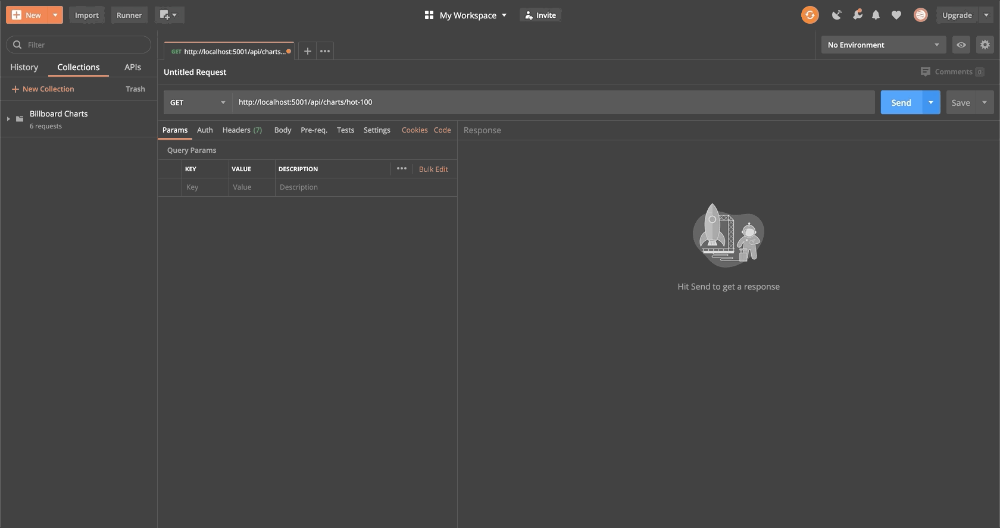

Billboard-API
============

A simple Web API project for Billboard charts

## Setup
**Must have Visual Studio and latest .NET Core SDK installed**
1. Open Visual Studio
2. Restore NuGet Packages
3. Run project - Homepage with Swagger UI will automatically pop up, or
4. Navigate to http://localhost:5001/swagger/index.html

## How to Use

**Basic Endpoint**

```
http://localhost:5001/api/charts/{name}
http://localhost:5001/api/charts/{name}/{date}
```

**Sample Chart Names**

- hot-100
- pop-songs
- dance-electronic-songs
- r-b-hip-hop-songs
- country-songs

### Postman


### Swagger
